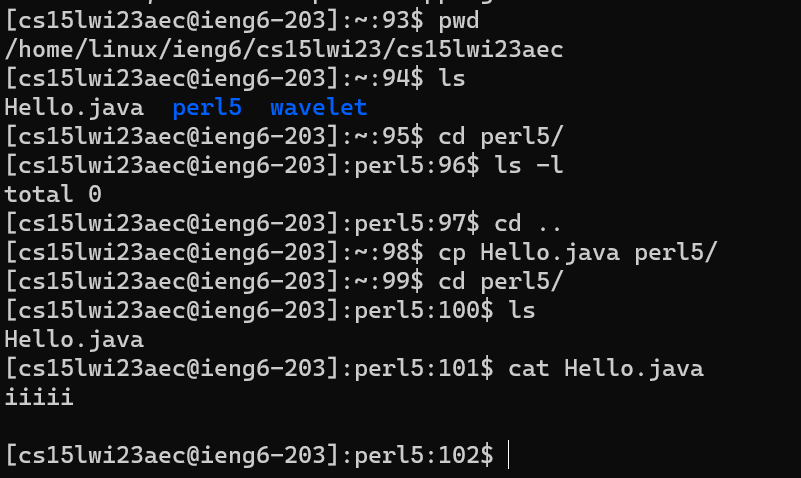

Author: Eric Yan  
PID: A17341154  

# Tutorial about how to log into CSE 15L course-specific account

## Part 1: Install Vscode

1. To download Vscode, go to [Visual Studio Code Website](https://code.visualstudio.com/).
2. Click the side bar of the download button and select the version that fits your operating system.
   - 
3. Download and install vscode following the instructions.
4. Open vscode. It should show a window like the picture above. Colors may be different, depending on your theme setting.
    - 

## Part 2: Remotely Connecting

1. If you use Windows, install [Git for Windows](https://gitforwindows.org/) on your computer
2. Set the default terminal of Vscode to be `git bash` following the [instruction](https://stackoverflow.com/a/50527994)
3. Open a new terminal in vscode (if not already so). Press **ctrl**(Windows)/**cmd**(MacOS) + \`. Or click **Terminal** -> **New Terminal** at the top menu.
4. Use `ssh` to remotely control, type in the comman like this `ssh cs15lwi23cc@ieng6.ucsd.edu`. Replace `cc` with the letters in your course-specific account.
5. Type the password of your account. Note that the content that you type in will not be shown in the terminal.
6. You may get a message like this if you are first time loggin in
   > The authenticity of host 'ieng6.ucsd.edu (128.54.70.227)' can't be established. RSA key fingerprint is SHA256:ksruYwhnYH+sySHnHAtLUHngrPEyZTDl/1x99wUQcec. Are you sure you want to continue connecting (yes/no/[fingerprint])?
   - Type **yes** and press **enter**
7. If you log in successfully, you should see some text like the picture below
    - 

## Part 3: Run some commands on the remote server

1. Try to run some of the commands (`cd` `ls` `mkdir` `pwd` `cat`) below on **your computer** and the **remote computer** using the terminal of vscode. Do the commands run as you expect?
    - Demo of running some of the commands on my computer
      - 
      - When running these commands, I notice the effect of different options on the input of `ls`. For instance, `-l` will show more specific image about the file or directory,
         `-t` will show files from most recently modified to most remotely modified, and `-a` will show all hidden files starting with `.`. I can also combine these options together
         in any orders.
    - Demo of running some of the commands after ssh-ing to my CSE15L account
      - 
      - When I connect to the remote server, I find that the prompt of the terminal changes as a sign of connected successfully.  I use commands like `cd`, `ls`, `pwd`, `cp` to check the directory and files on the remote server. As I expect, these commands
         work the same as on my local computer. They just show files on the remote server.
      - 
      - However, when I try to change to the directory of my groupmate's account by using `cd`, I get a permission denied error. I guess that's for
         privacy protection because you cannot go to other users' account and edit files as you want. To get into my groupmate's directory, I probably need his password or the
         password of the administrator of the server.
2. To log out of the remote server, you can
   1. Press **ctrl** + **D**
   2. Type command `exit`
