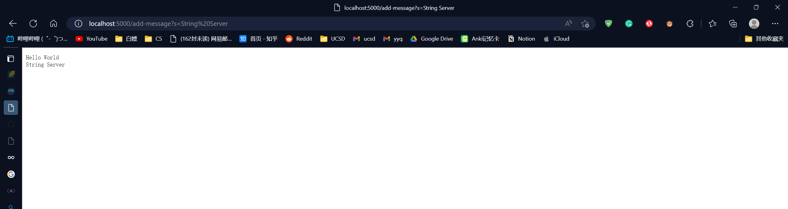

# Lab Report 2 - Servers and Bugs

- Author: Eric Yan
- PID: A1734 1154

## Part1: String Server

1. code

    ```java
    import java.io.IOException;
    import java.net.URI;

    class StringHandler implements URLHandler {
        String message = "";
        public String handleRequest(URI url) {
            if(url.getPath().equals("/")) {
                return message;
            } else if(url.getPath().contains("/add-message")) {
                String[] parameters = url.getQuery().split("=");
                if(parameters[0].equals("s")) {
                    message += parameters[1] + "\n";
                    return message;
                }
            } 
            return "404 not found";
        }
    }
    public class StringServer {
        private final static String MSG = "Missing port number!";
        public static void main(String[] args) throws IOException{
            if(args.length == 0){
                System.out.println(MSG);
                return;
            }
            int port = Integer.parseInt(args[0]);
            Server.start(port, new StringHandler());
        }
    }
    ```

2. Demo
   1. 
      - In this screenshot, `handleRequest(URI url)` is called. The method receives the url I type in the search bar "http://localhost:5000/add-message?s=Hello%20World" (%20 is space). By using the `.getPath()` method of URI class, the method realizes there is **add-message** in the url, so it prepares to add to `message`, a string field in the `StringHandler` class. The method first gets the query part of the url. Then it splits the query part with **=** as the separator and stores the separated strings into a string array `parameters`. If the first element is `s`, which means I input in the correct format, the program will concatenate the next index of `parameters` (part of the string on the right of =)  and a new line escape string `\n` to `message`. As a result, we can see "Hello World" shown on the page.  
   2. 
       - In this screenshot, I type the url "http://localhost:5000/add-message?s=String%20Server" to initiate another request. Again, `handleRequest(URI url)` receives the url as the argument. It identifies the **add-message** in the path and splits the query part with **=** as the separator. Then, the method finds that the first element of `parameters` equals to `s` so that it knows we input the correct format. Thus, it concatenates the right side of **=** to `message` and returns `message`, so we can see `message` on the page. Because `handleRequest` concatenates a `\n` at the end of `message` in the last request, **String Server** appear in a new line this time.

## Part2: A bug from lab3

- This is a bug in the **LinkedListExample.java"

1. Faliure-inducing input (append when there are multiple nodes in linkedlist)

    ```java
    @Test
    public void testAppend() {
        LinkedList ls = new LinkedList();
        ls.root = new Node(0, null);
        ls.root.next = new Node(4, null);
        Node preTail = ls.root.next;
        ls.append(3);
        Node curTail = ls.root;
        while(curTail.next != null) {
            curTail = curTail.next;
        }
        assertEquals(curTail, preTail.next);
        assertEquals(3, curTail.value);
        assertEquals(null, curTail.next);
    }
    ```

    - Symptom: The test never stops. There seems to be an infinite loop in `append()`

2. An input that doesn't induce a faliure (append when there's only one node in linkedlist)

    ```java
    @Test
    public void testAppend() {
        LinkedList ls = new LinkedList();
        ls.root = new Node(0, null);
        Node preTail = ls.root;
        ls.append(3);
        Node curTail = ls.root;
        while(curTail.next != null) {
            curTail = curTail.next;
        }
        assertEquals(curTail, preTail.next);
        assertEquals(3, curTail.value);
        assertEquals(null, curTail.next);
    }
    ```

3. Fix
   1. Before

        ```java
        public void append(int value) {
            if(this.root == null) {
                this.root = new Node(value, null);
                return;
            }
            // If it's just one element, add if after that one
            Node n = this.root;
            if(n.next == null) {
                n.next = new Node(value, null);
                return;
            }
            // Otherwise, loop until the end and add at the end with a null
            while(n.next != null) {
                n = n.next;
                n.next = new Node(value, null); //bug
            }
        }
        ```

   2. After

        ```java
        public void append(int value) {
            if(this.root == null) {
                this.root = new Node(value, null);
                return;
            }
            // If it's just one element, add if after that one
            Node n = this.root;
            if(n.next == null) {
                n.next = new Node(value, null);
                return;
            }
            // Otherwise, loop until the end and add at the end with a null
            while(n.next != null) {
                n = n.next;
            }
            n.next = new Node(value, null);
        }
        ```

   3. If you put `n.next = new Node(value, null)` in the while loop, the loop will never end. Because you keep assigning new value to `n.next`, `n.next` will never be null. The correct way to append is putting `n.next = new Node(value, null)` outside the while loop. In this case, the while loop will traverse to the last node of the linkelist, and `n.next new Node(value, null)` will append the new node to the last node.

## Part3: What I learned

- In lab2, I learned the sturcture of a url. It's pretty useful. Even though I have been using urls for a lont time, I never really understood their meaning. In addition, I learned many basic knowledge about web servers in lab2. In lab3, I learned the importance of testing a piece of code thoroughly. When I am finding the bug in the linkedlist example, I didn't find the bug in `append()` because I didn't test all the cases. Then I began testing `last()` straight away and used the buggy `append()` in the tester for `last()`. As a result, the tester for `last()` failed. It took me a long time to realize the bug is in `append()` instead of `last()`. This incident let me understand that don't use not fully tested code in tester. Also, if you don't spend time testing this piece of code thoroughly now, you will definitely spend more time on paying back for your laziness.
