# Lab Report 4: Quick Done

- Name: Eric Yan
- PID: A17341154

1. Delete existing forks on github.
   1. Go to the forked repository
    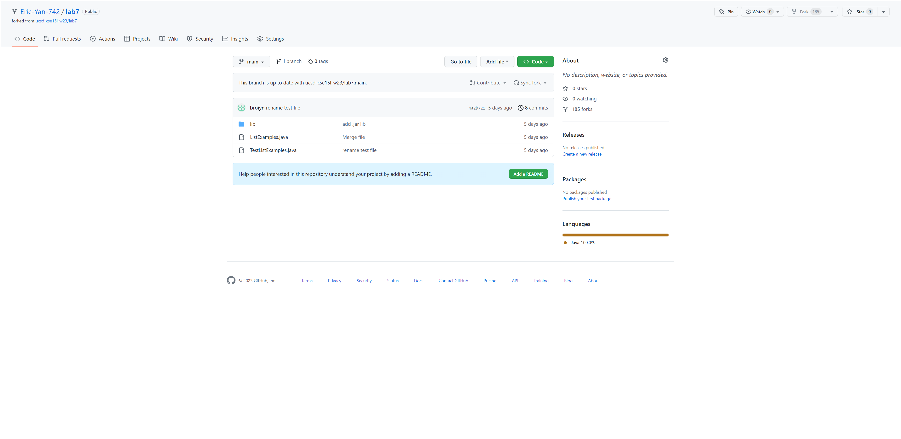
   2. Click **Settings** and scroll down
    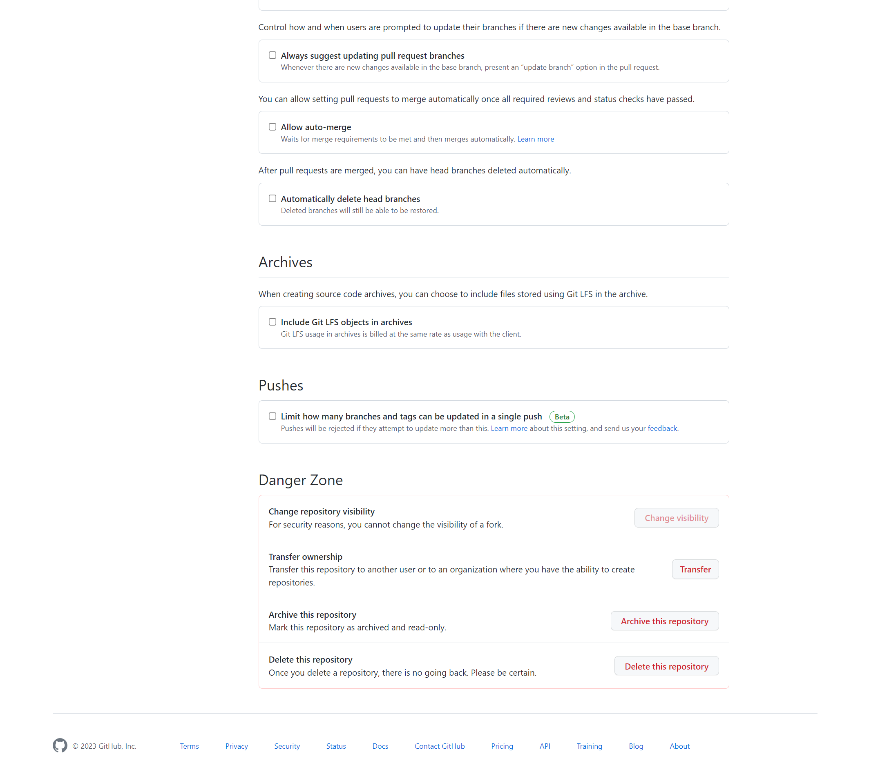
   3. Click **Delete this repository**
2. Setup Fork the repository
   1. Go to the home page of week 7 repository
    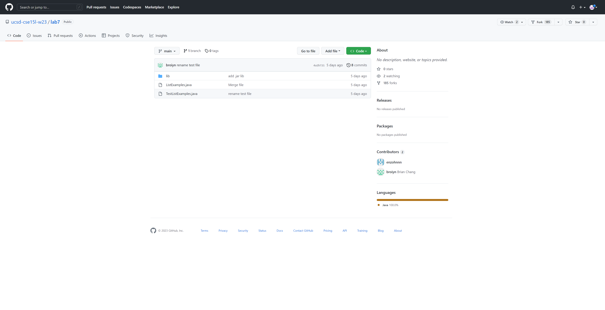
   2. Click **Fork** on the upper right corner to create a fork.
3. Start the timer  
    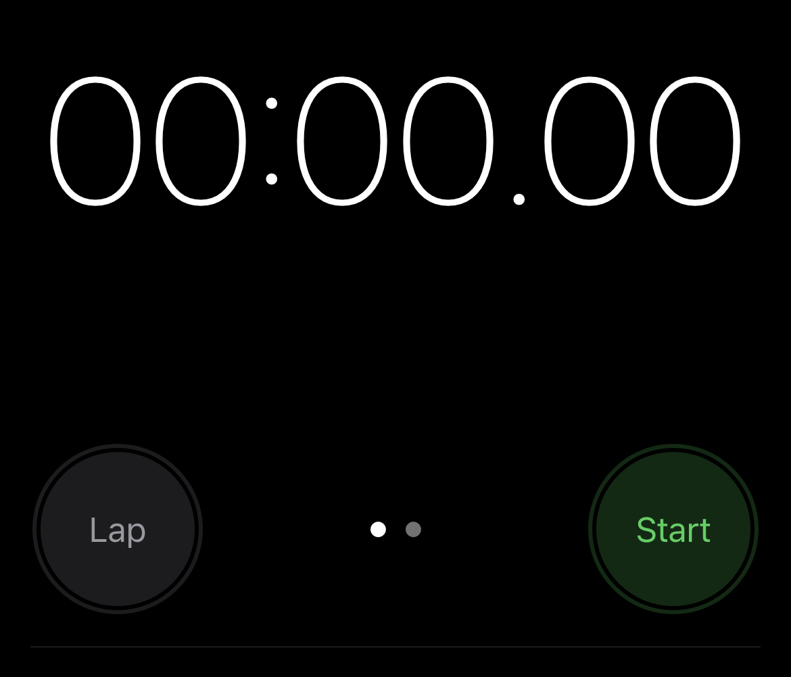
4. Log into ieng6
   1. Press `Ctrl+R`, `ssh`, `<enter>`. `Ctrl+R` will search my command history in reverse order. Since I used log into my remote account before, typing ssh automatically completes to the full command of login. Thus, I can log into my remote account by only typing `<enter>`
    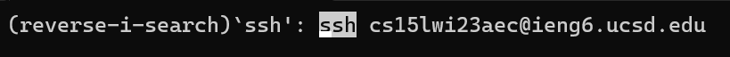
5. Clone the fork of the repository
   1. Go to the fork repository Github page. Copy the ssh link
    
   2. In the command line, type `git clone` and `Ctrl+V` to copy the ssh link. Then press `<enter>`
    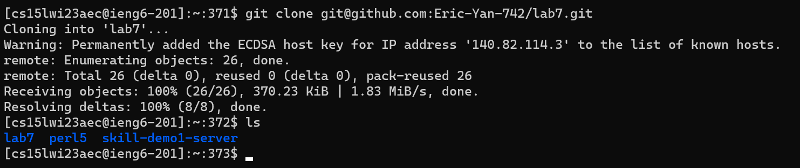
6. Run the tests
   1. Press `cd`, `l` `<tab>` to get into the directory of the repository
   2. Press `up` `up` `up` `up` to search for the "javac" command in my history. Then press `<enter>` I can access it quickly in this way because I just used it in lab.
   3. Press `up` `up` `up` `up` to search for the "java" command in my history to run the Junit tests. Then press `<enter>`. It works in a similar way as step 3.
   4. You can see the tests' result  
    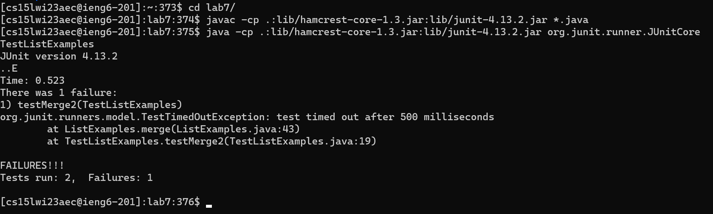
7. Edit the code file to fix the failing test
   1. Press `nano`,  `L` , `<tab>`, `j`, `<tab>`, `<enter>` to edit the ListExamples.java file through nano  
    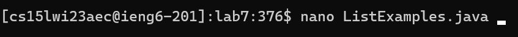
    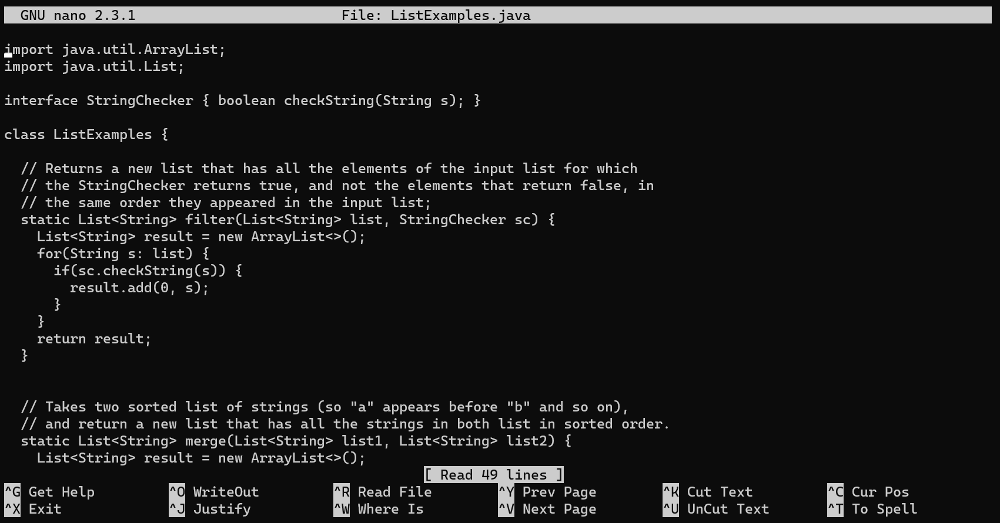
   2. Press `Ctrl+W`, `Alt+B`, `index1`, `<enter>` to jump to the spot we want to edit. `Ctrl+W` searches for text and jump to the target. `Alt+B` enables backward search mode, so we can reach that spot faster. `index1` is the variable name we want to go to.
    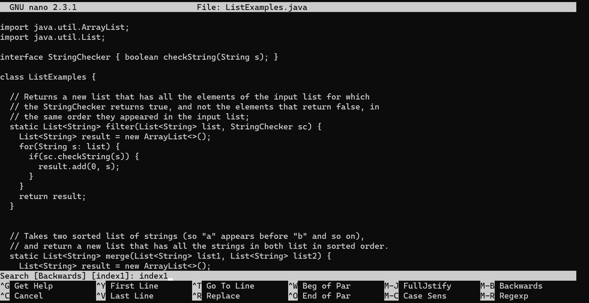
   3. Press `right` `right` `right` `right` `right` `right` `<backspace>` `2` to fix the bug
    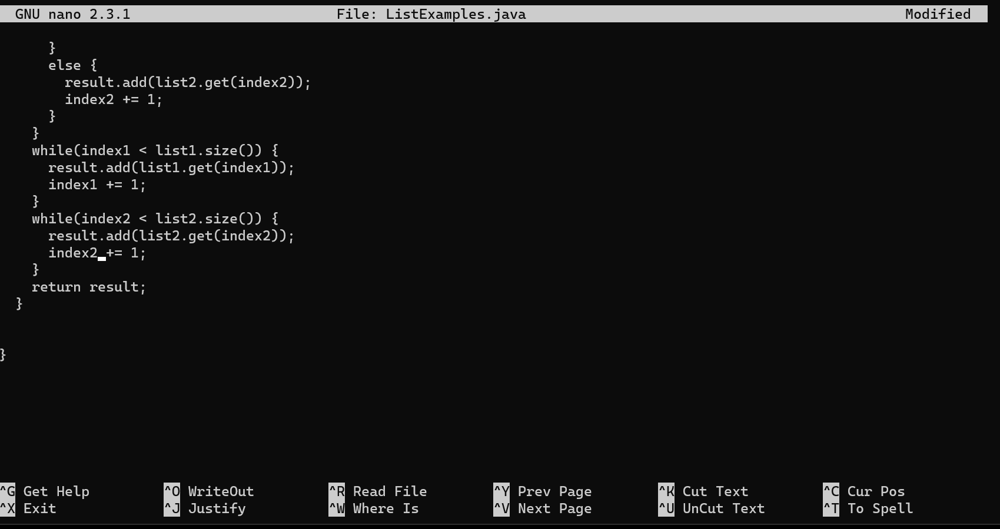
   4. Press `Ctrl+O` `<enter>` and `Ctrl+X` to exit nano.
8. Run the test again
   1. `up` `up` `up` `enter` to search for "javac" command and recompile all .java files
   2. `up` `up` `up` `enter` to search for "java" command and run Junit tests again
    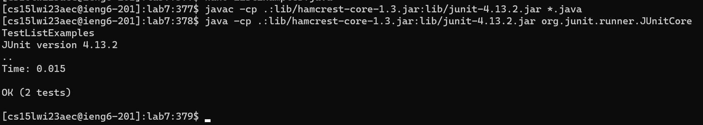
9. Commit and Push the changes to Github
   1. Press `git add L`, `<tab>`, `j`, `<tab>`, `<enter>` to add the change we just made
   2. Press `git commit -m "fix the bug"`, `<enter>` to commit the change
   3. Press `git push origin main`, `<enter>` to push to change to Github  
    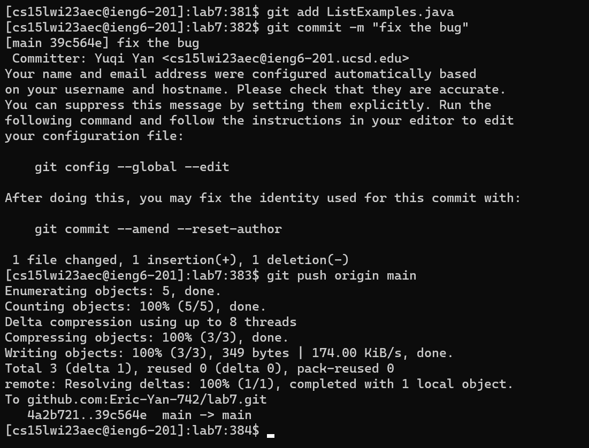